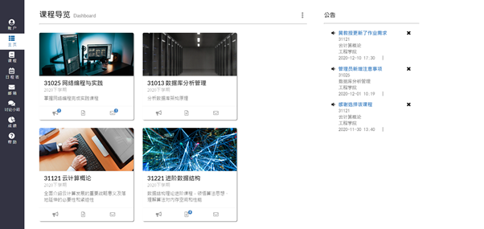

# Canvas-CN

This is a prototype for school learning material system designed for the university in China. 
Student can recieve new notification from professor, check their courses material, take a discussion about course, hand out assignment and recieve their result. 

Frontend: Vue.js 
Backend: Node.js 

<h3>Login</h3>

<h3>Dashboard</h3>

<h3>Courses Material</h3>

<h3>Student info</h3>

<h3>Discussion</h3>

